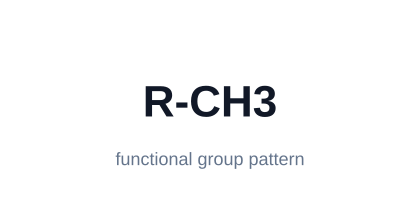
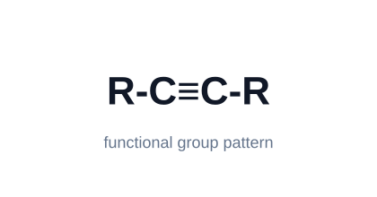
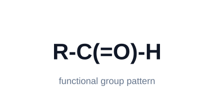
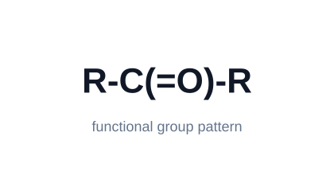
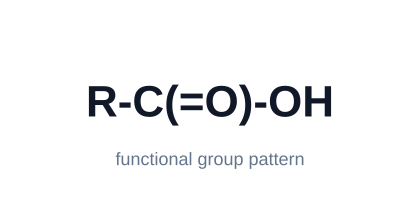
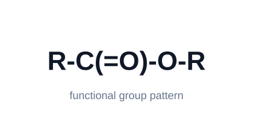
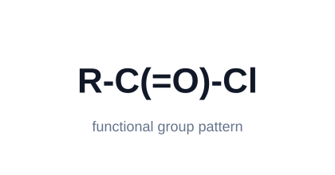
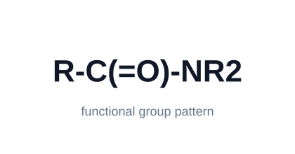
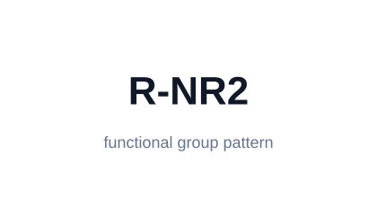
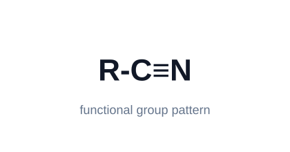

# 34 Organic Chemistry I

Organic Chemistry I cards for common naming pieces and functional-group
recognition. Image cards use simple functional-group pattern diagrams.

## A. Carbon Chain Prefixes

What prefix means 1 carbon? >> `meth-`.

What prefix means 2 carbons? >> `eth-`.

What prefix means 3 carbons? >> `prop-`.

What prefix means 4 carbons? >> `but-`.

What prefix means 5 carbons? >> `pent-`.

What prefix means 6 carbons? >> `hex-`.

What prefix means 7 carbons? >> `hept-`.

What prefix means 8 carbons? >> `oct-`.

What prefix means 9 carbons? >> `non-`.

What prefix means 10 carbons? >> `dec-`.

What does the root/prefix in an organic name usually tell you? >> The number of carbons in the parent chain.

What does `cyclo-` mean in a name? >> The carbon chain forms a ring.

What does `iso-` often suggest in common names? >> A branched structure, often with a methyl branch near the end.

What does `tert-` or `t-` suggest in common names? >> A tertiary carbon center attached to three carbons.

## B. Common Suffixes And Unsaturation

What suffix indicates an alkane? >> `-ane`.

What suffix indicates an alkene? >> `-ene`.

What suffix indicates an alkyne? >> `-yne`.

What suffix indicates an alcohol? >> `-ol`.

What suffix indicates an aldehyde? >> `-al`.

What suffix indicates a ketone? >> `-one`.

What suffix indicates a carboxylic acid? >> `-oic acid`.

What suffix indicates an ester? >> `-oate`.

What suffix indicates an amide? >> `-amide`.

What suffix indicates an amine? >> `-amine`.

What suffix indicates a nitrile? >> `-nitrile`.

What suffix indicates a thiol? >> `-thiol`.

What does `di-` mean in a name? >> Two of the named group or substituent.

What does `tri-` mean in a name? >> Three of the named group or substituent.

What does `tetra-` mean in a name? >> Four of the named group or substituent.

What does `diene` mean? >> A molecule with two carbon-carbon double bonds.

What does `yne` tell you about bonding? >> There is a carbon-carbon triple bond.

What does `ene` tell you about bonding? >> There is a carbon-carbon double bond.

## C. Naming Conventions

What is the parent chain? >> The main carbon chain chosen as the base of the name.

What is a substituent? >> A branch or group attached to the parent chain.

What does a number/locant do in a name? >> It tells where a substituent, multiple bond, or functional group is located.

What is the first major step in naming a simple organic molecule? >> Find the parent chain containing the highest-priority functional group or multiple bond.

What do you do after finding the parent chain? >> Number the chain to give important groups and multiple bonds the lowest reasonable numbers.

How are substituents listed in a name? >> Usually alphabetically, with locants showing their positions.

Do `di-`, `tri-`, and `tetra-` count for alphabetizing substituents? >> Usually no; alphabetize by the substituent name itself.

What does `N-` mean in names like `N-methylacetamide`? >> The substituent is attached to nitrogen.

What does `sec-` suggest? >> Attachment through a secondary carbon.

What does `neo-` suggest in common names? >> A highly branched neopentyl-like pattern.

## D. Hydrocarbon Functional Groups

What is an alkane? >> A hydrocarbon with only single carbon-carbon bonds; suffix `-ane`.

What is an alkene? >> A hydrocarbon containing a carbon-carbon double bond; suffix `-ene`.

What is an alkyne? >> A hydrocarbon containing a carbon-carbon triple bond; suffix `-yne`.

What is an arene? >> An aromatic ring system, commonly benzene-like.

What is the characteristic feature of an alkane? >> Saturated C-C single bonds.

What is the characteristic feature of an alkene? >> A C=C double bond.

What is the characteristic feature of an alkyne? >> A C≡C triple bond.

What is the characteristic feature of an arene? >> An aromatic ring with delocalized pi electrons.

Which functional group has only C-C single bonds? >> Alkane.

Which functional group has a C=C double bond? >> Alkene.

Which functional group has a C≡C triple bond? >> Alkyne.

Which functional group is benzene-like and aromatic? >> Arene.

What functional group is shown?  >> Alkane.

What functional group is shown?  >> Alkene.

What functional group is shown?  >> Alkyne.

What functional group is shown?  >> Arene.

Show the alkane functional group pattern. >> 

Show the alkene functional group pattern. >> 

Show the alkyne functional group pattern. >> 

Show the arene functional group pattern. >> 

## E. Oxygen-Containing Functional Groups

What is an alcohol? >> A compound with an `R-OH` hydroxyl group.

What is the characteristic feature of an alcohol? >> An `-OH` group bonded to carbon.

Which functional group has `R-OH`? >> Alcohol.

What is an ether? >> A compound with oxygen between two carbon groups: `R-O-R`.

What is the characteristic feature of an ether? >> An oxygen single-bonded to two carbon groups.

Which functional group has `R-O-R`? >> Ether.

What is an epoxide? >> A three-membered cyclic ether.

What is the characteristic feature of an epoxide? >> Oxygen in a strained three-membered ring.

Which functional group is a three-membered cyclic ether? >> Epoxide.

What is a peroxide? >> A compound with an oxygen-oxygen single bond: `R-O-O-R`.

What is the characteristic feature of a peroxide? >> An `O-O` single bond.

Which functional group has `R-O-O-R`? >> Peroxide.

What functional group is shown?  >> Alcohol.

What functional group is shown?  >> Ether.

What functional group is shown?  >> Epoxide.

What functional group is shown?  >> Peroxide.

Show the alcohol functional group pattern. >> 

Show the ether functional group pattern. >> 

Show the epoxide functional group pattern. >> 

Show the peroxide functional group pattern. >> 

## F. Carbonyl Functional Groups

What is a carbonyl group? >> A carbon double-bonded to oxygen: `C=O`.

What is an aldehyde? >> A carbonyl with at least one hydrogen on the carbonyl carbon: `R-C(=O)-H`.

What is the characteristic feature of an aldehyde? >> A terminal carbonyl bonded to hydrogen.

Which functional group has `R-C(=O)-H`? >> Aldehyde.

What is a ketone? >> A carbonyl carbon bonded to two carbon groups: `R-C(=O)-R`.

What is the characteristic feature of a ketone? >> A carbonyl in the middle of a carbon chain, bonded to two carbons.

Which functional group has `R-C(=O)-R`? >> Ketone.

What is a carboxylic acid? >> A carbonyl attached to hydroxyl: `R-C(=O)-OH`.

What is the characteristic feature of a carboxylic acid? >> The `-COOH` group.

Which functional group has `R-C(=O)-OH`? >> Carboxylic acid.

What is an ester? >> A carbonyl attached to an oxygen attached to carbon: `R-C(=O)-O-R`.

What is the characteristic feature of an ester? >> `R-C(=O)-O-R`.

Which functional group has `R-C(=O)-O-R`? >> Ester.

What is an acid chloride? >> A carbonyl attached to chlorine: `R-C(=O)-Cl`.

Which functional group has `R-C(=O)-Cl`? >> Acid chloride.

What is an amide? >> A carbonyl attached to nitrogen: `R-C(=O)-N`.

What is the characteristic feature of an amide? >> A carbonyl directly bonded to nitrogen.

Which functional group has a carbonyl directly bonded to nitrogen? >> Amide.

What functional group is shown?  >> Aldehyde.

What functional group is shown?  >> Ketone.

What functional group is shown?  >> Carboxylic acid.

What functional group is shown?  >> Ester.

What functional group is shown?  >> Acid chloride.

What functional group is shown?  >> Amide.

Show the aldehyde functional group pattern. >> 

Show the ketone functional group pattern. >> 

Show the carboxylic acid functional group pattern. >> 

Show the ester functional group pattern. >> 

Show the acid chloride functional group pattern. >> 

Show the amide functional group pattern. >> 

## G. Nitrogen-Containing Functional Groups

What is an amine? >> A nitrogen-containing group related to ammonia, often `R-NH2`, `R2NH`, or `R3N`.

What is the characteristic feature of an amine? >> Nitrogen single-bonded to carbon and/or hydrogen, without an adjacent carbonyl.

Which functional group has nitrogen single-bonded to carbon groups but no carbonyl? >> Amine.

What is a nitrile? >> A carbon triple-bonded to nitrogen: `R-C≡N`.

What is the characteristic feature of a nitrile? >> A `C≡N` triple bond.

Which functional group has `R-C≡N`? >> Nitrile.

What is an azide? >> A group with three nitrogens, commonly written `R-N3`.

What is the characteristic feature of an azide? >> The `N3` group.

Which functional group has `R-N3`? >> Azide.

How do amines and amides differ? >> Amines have nitrogen without an adjacent carbonyl; amides have nitrogen directly attached to a carbonyl.

How do nitriles and amines differ? >> Nitriles contain `C≡N`; amines have nitrogen single-bonded to carbon/hydrogen.

What functional group is shown?  >> Amine.

What functional group is shown?  >> Nitrile.

Show the amine functional group pattern. >> 

Show the nitrile functional group pattern. >> 

## H. Sulfur-Containing Functional Groups

What is a thiol? >> A sulfur analog of an alcohol: `R-SH`.

What is the characteristic feature of a thiol? >> An `-SH` group.

Which functional group has `R-SH`? >> Thiol.

What is a thioether? >> A sulfur analog of an ether: `R-S-R`.

What is the characteristic feature of a thioether? >> Sulfur single-bonded to two carbon groups.

Which functional group has `R-S-R`? >> Thioether.

How do alcohols and thiols differ? >> Alcohols have `R-OH`; thiols have `R-SH`.

How do ethers and thioethers differ? >> Ethers have `R-O-R`; thioethers have `R-S-R`.

What functional group is shown?  >> Thiol.

What functional group is shown?  >> Thioether.

Show the thiol functional group pattern. >> 

Show the thioether functional group pattern. >> 

## I. Recognition Questions

A functional group with a carbonyl bonded to hydrogen is what? >> Aldehyde.

A functional group with a carbonyl bonded to two carbon groups is what? >> Ketone.

A functional group with `-COOH` is what? >> Carboxylic acid.

A functional group with a carbonyl bonded to `OR` is what? >> Ester.

A functional group with a carbonyl bonded to nitrogen is what? >> Amide.

A functional group with oxygen between two carbon groups is what? >> Ether.

A functional group with `-OH` on carbon is what? >> Alcohol.

A functional group with nitrogen single-bonded to carbon groups is what? >> Amine.

A functional group with `C≡N` is what? >> Nitrile.

A functional group with `-SH` is what? >> Thiol.

A functional group with sulfur between two carbon groups is what? >> Thioether.

A hydrocarbon with a double bond is what? >> Alkene.

A hydrocarbon with a triple bond is what? >> Alkyne.

A benzene-like aromatic ring is what? >> Arene.

What is the key difference between aldehydes and ketones? >> Aldehydes have a carbonyl H; ketones have the carbonyl carbon bonded to two carbons.

What is the key difference between esters and carboxylic acids? >> Esters have `-COOR`; carboxylic acids have `-COOH`.

What is the key difference between amides and amines? >> Amides have a carbonyl attached to nitrogen; amines do not.

What is the key difference between ethers and alcohols? >> Ethers have `R-O-R`; alcohols have `R-OH`.

What is the key difference between thiols and alcohols? >> Thiols use sulfur, `R-SH`; alcohols use oxygen, `R-OH`.

## J. Quick Name Examples

What functional group is in methanol? >> Alcohol.

What functional group is in ethanol? >> Alcohol.

What functional group is in propanone? >> Ketone.

What functional group is in butanal? >> Aldehyde.

What functional group is in ethanoic acid? >> Carboxylic acid.

What functional group is in ethyl ethanoate? >> Ester.

What functional group is in ethanamine? >> Amine.

What functional group is in ethanenitrile? >> Nitrile.

What functional group is in ethanethiol? >> Thiol.

What suffix would you expect for butanone? >> `-one`, a ketone.

What suffix would you expect for butanal? >> `-al`, an aldehyde.

What suffix would you expect for butanol? >> `-ol`, an alcohol.

What suffix would you expect for butanoic acid? >> `-oic acid`, a carboxylic acid.

## K. Cyclohexane Axial And Equatorial Relationships

In a 1,2-cis disubstituted cyclohexane, what axial/equatorial relationships are possible? >> `a,e` or `e,a`.

In a 1,2-disubstituted cyclohexane, which cis/trans pattern has `a,e` or `e,a` relationships? >> 1,2-cis disubstituted.

In a 1,2-trans disubstituted cyclohexane, what axial/equatorial relationships are possible? >> `a,a` or `e,e`.

In a 1,2-disubstituted cyclohexane, which cis/trans pattern has `a,a` or `e,e` relationships? >> 1,2-trans disubstituted.

In a 1,3-cis disubstituted cyclohexane, what axial/equatorial relationships are possible? >> `a,a` or `e,e`.

In a 1,3-disubstituted cyclohexane, which cis/trans pattern has `a,a` or `e,e` relationships? >> 1,3-cis disubstituted.

In a 1,3-trans disubstituted cyclohexane, what axial/equatorial relationships are possible? >> `a,e` or `e,a`.

In a 1,3-disubstituted cyclohexane, which cis/trans pattern has `a,e` or `e,a` relationships? >> 1,3-trans disubstituted.

In a 1,4-cis disubstituted cyclohexane, what axial/equatorial relationships are possible? >> `a,e` or `e,a`.

In a 1,4-disubstituted cyclohexane, which cis/trans pattern has `a,e` or `e,a` relationships? >> 1,4-cis disubstituted.

In a 1,4-trans disubstituted cyclohexane, what axial/equatorial relationships are possible? >> `a,a` or `e,e`.

In a 1,4-disubstituted cyclohexane, which cis/trans pattern has `a,a` or `e,e` relationships? >> 1,4-trans disubstituted.
